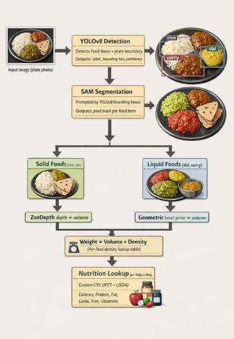

# Milestone 1 Report

Group 2  
Data Science and AI Lab Project  

## Milestone 1 Report

Project Title: Nutri Vision – AI Food Analyzer  

Group 2  

| Roll Number | Student Name |
|------------|-------------|
| 23f3001764 | Sahil Raj |
| 23f1001232 | Sahil Sharma |
| 22f3003055 | Aman Mani Tiwari |
| 22f3000089 | Samreen Fathima |
| 22f2001653 | Tasneem Shahnawaz |
---
Content  
1. Abstract  
2. Objectives  
3. Literature Review  
• Food Image Classification  
• Nutrition Estimation Systems  
4. Contribution of Proposed Solution  
5. Model Architecture  
6. Detection Pipeline  
7. Nutrition Mapping  
8. Conversational Layer  
9. Dataset and Compute  
10. Evaluation  
11. Roles  
12. Timeline  
13. Conclusion  
---
## Abstract

Starting with a photo of a meal, NutriVision identifies each food present using YOLOv8, a deep learning model built for spotting objects. Instead of relying on manual input, it outlines both individual foods and the plate itself within the image. Once boundaries are set, the system computes how much space each item takes up compared to the whole plate. This visual proportion feeds into a calculation that turns pixel areas into real-world weights, measured in grams. After labeling what each dish component is, data links to a detailed nutrition reference. From there, values emerge for energy, proteins, carbs, lipids, plus key dietary elements - without needing extra user effort.

Personalized assessment of nutrient intake begins by processing details like age, body measurements, gender, and daily physical activity. Following this evaluation, a chat-style interface powered by artificial intelligence offers straightforward eating guidance. What drives the entire effort is a practical framework combining image recognition, food composition prediction, and smart advice delivery. Easier monitoring of meals - particularly those common in India - is made possible through seamless integration of these components.

---
## Objectives

The primary objectives of the NutriVision project are:
1. To develop a multi-food detection system using YOLOv8 capable of identifying multiple food items in a single image.
2. To estimate portion size using a plate-reference scaling method based on pixel area comparison.
3. To compute accurate nutritional values by mapping detected food items to a structured nutrition database.
4. To perform personalized nutritional gap analysis using standard calorie requirement equations.
5. To generate AI-based conversational dietary suggestions using structured prompts.
6. To design and deploy a complete end-to-end web application integrating all system components.
---
## Literature Review

### Food Image Classification

With deep learning now common in food image analysis, CNNs stand out as a key approach. A dataset often used for testing methods is Food-101 - this one covers 101 types of dishes and includes more than 100,000 photos. Instead of building models from the ground up, studies find better results when starting with existing architectures like ResNet or EfficientNet. Performance jumps notably through transfer learning, where earlier knowledge aids new tasks.

Now imagine spotting every item on a crowded dinner plate - modern systems make it possible. Thanks to updates in tools such as YOLO, finding many things in one picture happens instantly. While older methods assign just a single category to an entire photo, these newer versions draw boxes around each edible part they see. Because meals often mix more than one dish, pinpointing individual foods becomes far more practical. Detection shifts from guessing what's there to showing exactly where each piece sits.

Still, much current research centers on Western food data. Though Indian meals frequently combine multiple ingredients on one plate, they appear rarely in open datasets. Because of this gap, systems must adapt to varied cultural food types.  

### Nutrition Estimation Systems

Starting off, apps like MyFitnessPal and CalorieMama include tools to track calories. Yet users must frequently log meals by hand - this step takes effort, sometimes leads to mistakes. Moving on, certain platforms analyze images to guess calorie counts; despite that, portion sizes are typically standardized, say 100g portions. Because of this approach, actual serving amounts seen in photos get overlooked too easily.

What you eat matters less than how much. Guessing food amount from a flat photo struggles without 3D clues. Earlier fixes tried rulers or special cameras - awkward outside labs.

Few current platforms analyze individual nutrition gaps using personal details like age, body mass, or physical exertion. Connection between image-based meal detection and intelligent eating suggestions remains sparse.

One reason behind building such systems lies in overcoming existing gaps through unified design. A solution emerges when food identification works alongside portion analysis, not apart from it. Linking these steps to organized nutrient data creates clearer pathways for dietary insight. Instead of isolated functions, cohesion matters - intelligence adapts once personal patterns shape guidance. End-to-end flow makes coordination possible without switching between separate tools. 

---
## Contribution of Proposed Solution

The proposed solution, NutriVision – AI Food Analyzer, contributes to the existing research landscape by addressing key limitations observed in current food recognition and nutrition estimation systems, especially in the Indian context.

First, unlike traditional food classification models that assign a single label to an entire image, NutriVision implements a multi-food detection framework using YOLOv8. This enables identification of multiple food items on a single plate, which is particularly important for Indian meals where diverse dishes are commonly served together. By detecting both the plate boundary and individual food items, the system ensures more structured and realistic meal analysis.

Second, the project introduces an improved portion size estimation mechanism. Instead of assuming standardized serving sizes (e.g., fixed 100g portions), NutriVision uses a plate-reference scaling method based on pixel-area ratios. This approach converts visual proportions into approximate real-world weight values. By integrating segmentation and depth-based or geometric priors, the system enhances portion accuracy without requiring additional hardware such as depth cameras or manual measurements. This makes the solution practical and scalable for real-world use.

Third, NutriVision builds a custom nutrition mapping database that combines validated sources such as IFCT and USDA while also incorporating Indian regional foods that are often missing from global datasets. This localized database ensures culturally relevant and accurate nutrient estimation. The structured CSV-based system also allows easy extensibility for future additions.

Another major contribution is the integration of a personalized nutritional gap analysis layer. Instead of merely reporting calorie counts, the system evaluates nutrient intake against individual requirements calculated using standard equations such as the Mifflin-St Jeor formula. This allows the platform to move beyond passive tracking toward active dietary assessment.

Finally, NutriVision integrates a conversational AI suggestion layer powered by structured prompting. The system provides meal balance feedback, nutrient gap correction suggestions, and supplement guidance in a human-readable format. Unlike many calorie-tracking apps that rely on manual logging or isolated analytics, this project delivers an end-to-end pipeline—from food detection to personalized advice—within a single unified framework.

Overall, the key contribution of NutriVision lies in combining object detection, portion estimation, structured nutrition mapping, and AI-driven conversational guidance into one coherent, culturally adapted system. This holistic integration differentiates it from existing solutions that typically address these components independently.

---
## Model Architecture

NutriVision is built as a sequential four-stage pipeline. A photograph of a meal enters the system and passes through each stage in order following  detection, segmentation, weight estimation, and nutrition mapping — before producing a final nutrient breakdown.

The detection stage uses YOLOv8, which scans the image and draws bounding boxes around each food item and the plate boundary. It outputs a class label and confidence score for every detected item. The segmentation stage uses SAM (Segment Anything Model), which takes the bounding boxes from YOLOv8 as prompts and produces precise pixel-level masks for each food item. Together these two models form the visual understanding core of the system.

The weight estimation stage treats solid foods and liquid foods differently. For solid items like rice and roti, a monocular depth model (ZoeDepth) estimates the depth map from the single image, and volume is computed by combining the depth values with the pixel mask. For liquid or semi-liquid items like dal, a geometric prior approach is used — the bowl is detected, its diameter is estimated using the plate as a reference, and volume is calculated from bowl geometry and estimated fill level. In both cases, weight is obtained by multiplying volume by a food-specific density value stored in a lookup table.

The nutrition mapping stage takes the food label and estimated grams from the previous stage and queries a custom CSV database built from IFCT 2017 and USDA FoodData Central and custom dataset and other kaggle datasets All values are stored per 100g and scaled using the formula: Scaled Nutrition = (Nutrition per 100g × Estimated Grams) / 100.

### Food Classification Pipeline  

### Nutrition Mapping Layer

After detecting food items and estimating portion sizes, the system maps each identified food item to its nutritional information. The Nutrition Mapping Layer converts detected foods and portion estimates into numerical nutrient values. A custom CSV-based nutrition database is created, where each food item is linked to its standardized nutrient profile. This database ensures consistent and reliable mapping between detected food labels and nutrition values. Many Indian and regional foods are not available in standard nutrition APIs, so the custom database allows inclusion of culturally relevant dishes. It helps the system calculate nutrients accurately without relying on external APIs. The structured database also makes it easy to add new foods and regional datasets in the future.

The database stores nutrition information for each food item, such as:
- Calories (kcal)
- Protein (g)
- Carbohydrates (g)
- Fat (g)
- Dietary Fiber (g)
- Iron (mg)
- Calcium (mg)
- Vitamins (A, B-complex, C, D, etc.)

The YOLOv8 model detects food items from an image and outputs the food labels. These labels are matched with the corresponding entries in the custom nutrition database to retrieve nutrient values for each detected food item.

Since database values are given per 100 grams, the system scales them based on the estimated portion size using the formula:
**Scaled Nutrition = (Nutrition per 100g × Estimated grams) / 100**

The nutrition values are collected from trusted sources such as:
- USDA FoodData Central
- Indian Food Composition Tables (IFCT)

These sources provide scientifically validated nutrient information.

### Conversational Suggestion Layer

The Conversational Suggestion Layer is responsible for providing personalized dietary guidance based on the outputs from the previous layers (food detection, portion estimation, and nutrient mapping). It leverages a Large Language Model (LLM) API (Claude) to generate context-aware, human-readable suggestions. It takes in a structured prompt that includes the user’s profile (age, weight, height, activity level, and food preferences), the detected foods in their meal with estimated portion sizes, and an analysis of nutrient gaps. 

In this layer, the LLM gives diet suggestions without using any external data or extra training. This means the system does not search the internet or other databases (no RAG), and the Claude model is used as it is, without fine-tuning. Instead, carefully designed prompts are used to guide the model. These prompts include the user’s profile, detected foods, and nutrient gap analysis, so the system can give accurate, relevant, and personalized dietary advice.

The system generates three types of guidance: feedback on how balanced the meal is, suggestions on what to eat next to fix nutrient gaps, and advice on supplements if required. By combining this layer with food detection, portion size estimation, and nutrition mapping, NutriVision offers a complete and easy system for tracking diet. It not only tells the user what they ate, but also helps them understand their eating habits and improve their food choices. This makes NutriVision more useful and practical than existing apps that only count calories or require users to enter meals manually.

---
## Dataset Availability

NutriVision requires datasets containing annotated food images for object detection and nutritional information of foods for accurate analysis and suggestions. This involves a combination of publicly available and custom datasets curated for indian cusine.
Datasets for Food Detection:
- [Food 101 dataset](https://www.kaggle.com/datasets/dansbecker/food-101/data)
   - Around 10,10,00 images across 101 food categories, divided into 750 training images and 250 test images for each class, covering global cuisines.
   - Used as a benchmark dataset to initialize and pretrain the food recognition capability of the model for strong feature learning
- [Indian Food Images Dataset](https://www.kaggle.com/datasets/iamsouravbanerjee/indian-food-images-dataset)
   - In this Dataset, there are 4000 Indian Food Images in 80 different categories or classes.
   - Contains commonly consumed Indian dishes such as dosa, idli, biryani, paneer-based dishes, dal, and curries, which will improve model performance on Indian cuisine.
- Custom annotated dataset
   - Various images of Indian mixed meals are generally missing in public datasets. Hence, a custom set of images will be captured and annotated manually
    - The annotations are done using Roboflow with bounding boxes drawn for individual food items and plates.

Datasets for nutrition information:
- [Indian Food 101 dataset](https://www.kaggle.com/datasets/nehaprabhavalkar/indian-food-101)
   - This dataset consists of information about 250 Indian dishes, their ingredients, their place of origin, etc.
   - Used for food label validation and mapping
- [Indian Food Nutritional Values Dataset (2025)](https://www.kaggle.com/datasets/batthulavinay/indian-food-nutrition)
   - This dataset contains nutritional values of various Indian dishes, including calories, protein, fats, carbohydrates, and micronutrients.
   - Each detected food label is mapped to this dataset
   - It may be extended with a custom nutrition database for more structured storage of information, and also to include missing data.

---
## Computation Feasibility

Model training will be performed using Google Colab Pro, as it provides access to cloud-based GPU resources. The NVIDIA T4 GPU will be used to fine-tune modern object detection models efficiently. The food detection stage uses YOLOv8, a real-time object detection model optimized for both speed and accuracy. Rather than training the model from scratch, a transfer learning approach is adopted by fine-tuning only the final layers of a pretrained YOLOv8 model. Batch size optimization is planned, and the size will be decided based on the input pixel dimensions and GPU memory available.

Once the training step is completed (around 2-4 hours), the rest of the pipeline incurs less computational cost as portion size estimation, nutrition computation, and text generation using the Claude API all require minimal computational power.

---
## Evaluation Metrics

Evaluation metrics are used at each stage of the pipeline to ensure the reliability and accuracy of the estimated  outputs.  

### Food detection evaluation

At this stage, the boundaries of the food items and the plate are defined for accurate nutrition calculation. The  following metrics are used for evaluation at this stage:  
- Mean average precision - measures overall detection accuracy across all food classes

    $\mathrm{mAP} = \frac{1}{C} \sum_{c=1}^{C} AP_c$

- Precision - Shows how many detected food items are correct  
     $\mathrm{Precision} = \frac{TP}{TP + FP}$

- Recall - Highlights the ability to correctly detect all food items on the plate  
      $\mathrm{Recall} = \frac{TP}{TP + FN}$

- F1 score - provides a balanced evaluation between precision and recall

  $\mathrm{F1} = 2 \cdot \frac{\mathrm{Precision} \cdot \mathrm{Recall}}{\mathrm{Precision} + \mathrm{Recall}}$ 

### Portion size estimation

At this step, portion size is estimated by performing the plate-to-food pixel area ratio method  
- A custom dataset containing the ground truth weight of food items will be used for evaluation  
- Mean Absolute Error (MAE) between the predicted weight in grams and the corresponding ground truth measurements will be calculated to evaluate the weight estimation model. 

  $\mathrm{MAE} = \frac{1}{N} \sum_{i=1}^{N} |y_i - \hat{y}_i|$

### Gap analysis suggestions evaluation

Here, the estimated nutrition requirements are compared wiHere, the estimated nutrition requirements are compared with the required daily energy intake of the user by calculation of BMR (Basal Metabolic Rate) using the Mifflin-St Jeor equation and other real-world nutritional intake values. So, the suggestions made as a result of the analysis will be scored as follows:

- Guidelines regarding the average minimum required nutrition intake values for adult men and women containing information on daily needed calories, protein, fat, threshold bands, etc., are referred from the WHO reports and evaluated across LLM suggestions to ensure that the model does not suggest unsafe and extremely low intake values.

- A Relevance score is calculated through human evaluation by using a normalized rating scale that scores the relevance of the suggestions made. This is meant for qualitative measurement of outputs.

---
## Roles

Project Manager – Coordination, documentation, milestone tracking  
Vision Lead – Dataset preparation, model training, evaluation  
Data Lead – Nutrition database creation and preprocessing  
Backend Lead – Integration of classification and AI modules  
Frontend Lead – UI design and deployment 

---
## Timeline

Week 1–2:  
Literature review, dataset collection, and preprocessing  

Week 3–4:  
Model setup and initial training  

Week 5–6:  
Hyperparameter tuning and evaluation  

Week 7–8:  
Integration of the AI suggestion layer  

Week 9:  
Deployment and testing  

---
## Conclusion

A key step involved outlining the core challenge, followed by an exploration of existing research tied to  
identifying food through images and digital nutrition tools. To move forward, the framework for NutriVision  
took shape during this phase. Instead of treating each function separately, the initiative brings together visual  
recognition with interactive dialogue systems powered by artificial intelligence. The coming phases will shift  
attention toward gathering data, refining models, testing performance, and then launching the system.

---
Created by **Group 2**
