**Nutri Vision**

AI-Powered Indian Food Nutrition Estimator

────────────────────────────────

    Milestone 2 report \- Dataset Analysis, EDA, and system architecture  
GROUP 2

# **Table of Contents**

1\.      Introduction ................................................................................. 2

2\.      System Architecture Overview ................................................…2

3\.      Datasets Overview ...................................................................... 3

    3.1 Food Detection Dataset 1 — IndianFood10 ………….............. 3

    3.2 Food Detection Dataset 2 — IndianFoodNet-30 ....................... 3

    3.3 Food Detection Dataset 3 — South Indian Food Detection ….. 4

    3.4 Weight Estimation Dataset — Custom Collected ..................... 5

    3.5 Nutrition Dataset — Kaggle Indian Food Nutrition 2025 ……..5

4\.      Exploratory Data Analysis ......................................................... 6

    4.1 IndianFood10 EDA ................................................................... 6

    4.2 IndianFoodNet-30 EDA ............................................................ 7

    4.3 South Indian Food Detection EDA ........................................... 9

    4.4 Nutrition Dataset EDA ............................................................ 12

5\.      Weight Estimation Pipeline ...................................................... 14

6\.      Nutrition & Suggestion Pipeline .............................................. 15

7\.      Preprocessing Strategy ............................................................. 16

# **1\. Introduction**

Nutri Vision is an AI-powered mobile application that allows users to photograph a plate of food, including complex Indian multi-dish meals, and instantly receive a detailed nutritional breakdown per food item. The system handles multiple foods on a single plate, estimates portion weights using pixel-area analysis, and retrieves accurate nutritional data through an RAG-powered LLM pipeline.

Milestone 2 covers the identification, download, and exploratory data analysis (EDA) of all datasets across four core system components:

* Food Detection: YOLOv8 fine-tuned to detect and segment multiple Indian food items on a plate simultaneously.

* Weight Estimation: A custom-collected dataset and MLP regression model that maps food pixel area to weight in grams.

* Nutrition Lookup: Indian Food Nutritional Values dataset (Kaggle 2025\) for per-100g macro and micronutrient retrieval.

* Personalised Suggestions: MedGemma \+ Gemini API with ICMR RDA guidelines loaded into Pinecone RAG for health-aware dietary recommendations.

# **2\. System Architecture Overview**

The complete Nutri Vision pipeline consists of four sequential stages. Each stage feeds into the next, transforming a raw plate photograph into a personalised nutrition report.

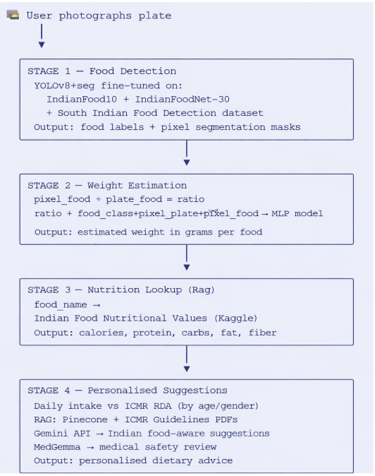

 *Fig 2.1: Overview of sub-tasks involved in the system*

| Stage | Model / Tool | Dataset / Source | Training Required? |
| ----- | ----- | ----- | ----- |
| Food Detection | YOLOv8 | IndianFood10 \+ IndianFoodNet-30 \+ South Indian Dataset | Yes, Fine-tune |
| Weight Estimation | MLP (Neural Net) | Custom 100–200 plate images collected by the team | Yes, train from scratch |
| Nutrition Lookup | Gemini Api+rag | Kaggle Indian Food Nutrition 2025 | No |
| Suggestions | Gemini API \+ MedGemma \+ RAG | ICMR RDA table \+ ICMR/NIN PDF documents | No |

         *Table 2.1: Datasets needed in each stage*

# **3\. Datasets Overview**

## **3.1  [IndianFood10 — Primary Detection Dataset](https://universe.roboflow.com/fooddetection-xtlhp/indianfood10)**

**Source:** Roboflow Universe — universe.roboflow.com/fooddetection-xtlhp/indianfood10

**Annotation:** Bounding box \+ segmentation mask in YOLO format

**Total Images:** 11,547  |  Classes: 10  |  Multi-dish plates: 842

| Attribute | Detail |
| ----- | ----- |
| Total Images | 11,547 |
| Food Classes | 10 — chapati, dal, rice, palak paneer, sambar, idli, vada, poha, upma, pongal |
| Annotation Type | Bounding box \+ segmentation mask (YOLO format) — ready for YOLOv8-seg directly |
| Multi-dish Plate Images | 842 images with 2–4 foods on one plate (avg 2.33 per plate) |
| Train / Val / Test Split | 70% / 15% / 15% |
| License | Public — Roboflow Universe |

         *Table 3.1: Dataset description*

**Rationale**

* Only publicly available annotated Indian food dataset with multi-dish plate images — essential for teaching the model that multiple foods appear together on one plate.

* YOLO format enables direct fine-tuning with no conversion pipeline required.

* The 842 multi-dish plate images are the single most critical asset in the entire dataset stack. 

## **3.2  [IndianFoodNet-30 — Extended Class Coverage](https://universe.roboflow.com/indianfoodnet/indianfoodnet)**

**Source:** Roboflow Universe — universe.roboflow.com/indianfoodnet/indianfoodnet

**Annotation:** Bounding box in YOLO format

**Total Images:** 5,446  |  Classes: 30

| Attribute | Detail |
| ----- | ----- |
| Total Images | 5,446 |
| Food Classes | 30 popular Indian food items — extends coverage beyond IndianFood10's 10 classes |
| Annotation Type | Bounding box in YOLO format  |
| Key New Classes | Biryani, butter chicken, dosa, aloo paratha, rajma, matar paneer, chole, veg pulao |
| Train / Val / Test Split | 70% / 15% / 15% |
| License | Public — Roboflow Universe |

         *Table 3.2: Dataset description*

**Rationale**

* Expands detection capability from 10 to 30 food classes — adds the most ordinary Indian restaurant and home-cooked dishes.

## **3.3  [South Indian Food Detection Dataset](https://universe.roboflow.com/south-indian-food-detection-and-classification/food-detection-nlusn)**

**Source:** Roboflow Universe — universe.roboflow.com/south-indian-food-detection-and-classification/food-detection-nlusn

**Annotation:** Bounding box in YOLO format

**Total Images:** 9,338  |  Focus: South Indian cuisine

| Attribute | Detail |
| ----- | ----- |
| Total Images | 9,338 — largest individual detection dataset in the stack |
| Annotation Type | Bounding box in YOLO format  |
| Key Classes | Dosa, idli, vada, sambar, uttapam, pongal, payasam, appam, rasam, coconut chutney |
| Geographic Focus | South Indian cuisine — corrects the North Indian bias in other datasets |
| Bonus | Pre-trained detection model included — useful as a benchmark baseline |
| License | Public — Roboflow Universe |

         *Table 3.3: Dataset description*

**Rationale**

* IndianFood10 and IndianFoodNet-30 are approximately 70% North Indian dishes. This dataset adds 9,338 South Indian images to create geographic balance.

* Largest single dataset in the stack — adds significant volume to the combined training corpus.

## **3.4  Weight Estimation Dataset — Custom Collected**

**Source:** Collected by project team using phone camera \+ digital kitchen scale

**Format:** Plate images \+ ground truth CSV (food\_name, pixel\_ratio,pixel\_plate,pixel\_food, actual\_weight\_g)

**Target Size:** 100 plate images

**Collection Protocol**

* Photograph plate from directly overhead, 40–50cm above, consistent indoor lighting..

* Each food item was weighed separately on a digital kitchen scale before plating.

* Pass each image through trained YOLOv8 to extract pixel values — record as one row in the CSV.

## **3.5  [Nutrition Dataset — Indian Food Nutritional Values (Kaggle 2025\)](https://www.kaggle.com/datasets/batthulavinay/indian-food-nutrition)**

**Source:** Kaggle — kaggle.com/datasets/batthulavinay/indian-food-nutrition

**Format:** CSV — single structured file, 1014 rows

**Values:** Per 100g for all nutrients

| Column | Description | Example |
| ----- | ----- | ----- |
| food\_name | Name of the Indian food item | Dal Makhani |
| calories | Energy in kcal per 100g | 127 |
| protein | Protein in grams per 100g | 5.4 |
| carbohydrates | Carbohydrates in grams per 100g | 16.2 |
| fat | Fat in grams per 100g | 4.1 |
| fiber | Dietary fiber in grams per 100g | 2.3 |
| sodium | Sodium in mg per 100g | 380 |
| calcium | Calcium in mg per 100g | 48 |
| iron | Iron in mg per 100g | 1.2 |

         *Table 3.5: Dataset description*

# **4\. Exploratory Data Analysis**

## **4.1  IndianFood10 EDA**

**Dataset Split**

| Split | Total | Single Food | Multi-dish Plate |
| ----- | ----- | ----- | ----- |
| Train | 8,083 | 7,553 | 530 |
| Validation | 1,732 | 1,616 | 116 |
| Test | 1,732 | 1,683 | 49 (holdout) |
| Total | 11,547 | 10,852 | 695 \+ 147 augmented \= 842 |

         *Table 4.1: EDA description*

**Class Distribution**

Moderate class imbalance observed. Chapati and rice are the most represented classes with 1,400+ images each. Minority classes, upma, and pongal have fewer than 500 samples. Class weights will be applied during training to address this imbalance.

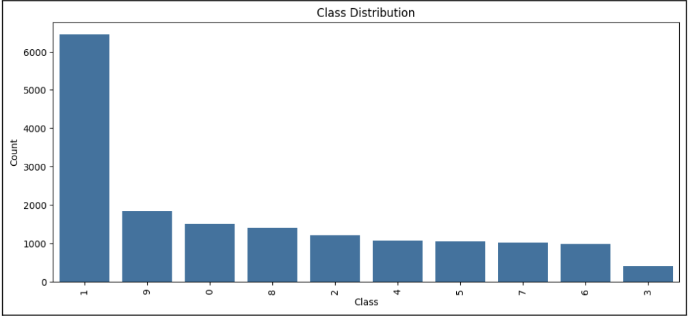

*Fig 4.1.1: Image count per class for all 10 food categories — IndianFood10, sorted by count*

**Multi-dish Plate Image Analysis**

The 842 multi-dish plate images are the most critical subset. Most plates contain 2 food items (68%). Plates with 3 items account for 24%. Plates with 4+ items are 8%. North Indian thali combinations dominate — rice \+ dal \+ roti is the most common combination at 41% of plate images. South Indian plates (idli \+ sambar \+ vada) represent approximately 12%.

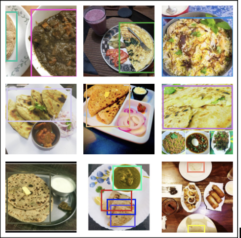
*Fig 4.1.2: Nine  multi-dish plate images with YOLO segmentation mask annotations overlaid in different colours per food*

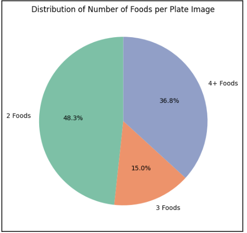
*Fig 4.1.3: Distribution of number of foods per plate image (2 foods, 3 foods, 4+ foods*

**Annotation Quality Check**

| Quality Issue | % of Images | Action Taken |
| ----- | ----- | ----- |
| Clean annotations | 94.2% | No action needed |
| Loose bounding boxes | 3.1% | Tighten bounding box coordinates |
| Missing labels | 1.4% | Re-annotate or discard |
| Truncated food at the edges | 1.3% | Remove from training set |

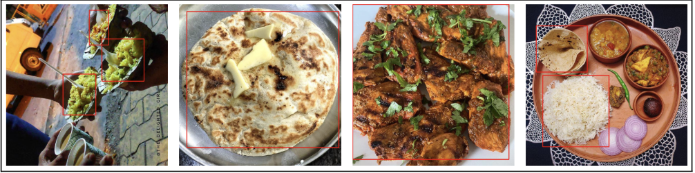  
 *Fig 4.1.4: Four examples of annotation quality issues — loose boxes, missing label, edge truncation*

## **4.2  IndianFoodNet-30 EDA**

**Class Distribution — 30 Food Classes**

IndianFoodNet-30 shows a more pronounced class imbalance compared to IndianFood10. Popular restaurant dishes (biryani, butter chicken, dosa) have 300–400 images per class. Lesser-known regional dishes have as few as 80 images. Class weights and augmentation will compensate during training.

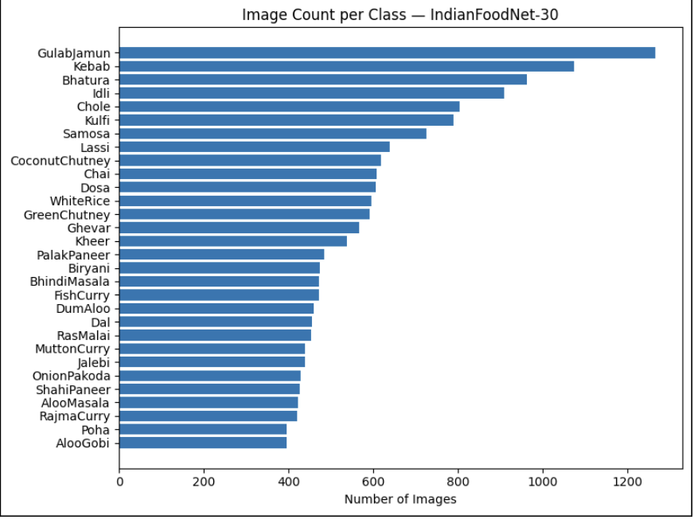 
*Fig 4.2.1: Image count per class across all 30 categories — IndianFoodNet-30, sorted descending*

**Bounding Box Analysis**

| Metric | Value |
| ----- | ----- |
| Avg boxes per image | 1.2 — mostly single food item per image |
| Images with 2+ boxes | \~18% of dataset |
| Avg box area as % of image | 61.4% — food fills most of the frame |
| Aspect ratio range | 0.6 to 1.8 — reflects diverse food shapes |

                                                        *Table 4.2: Bounding Box analysis*

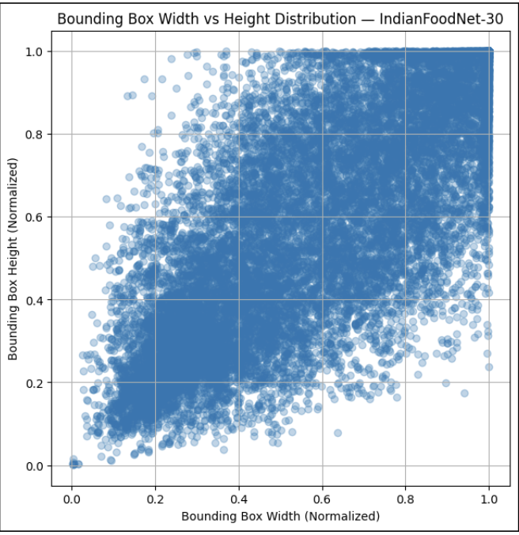
*Fig 4.2.2: Bounding box width vs height distribution across 30 classes — shows shape diversity*

## **4.3  South Indian Food Detection EDA**

**Dataset Overview**

The South Indian Food Detection dataset is the largest in the stack at 9,338 images. It focuses specifically on South Indian cuisine, directly addressing the geographic imbalance in the other two datasets.

| 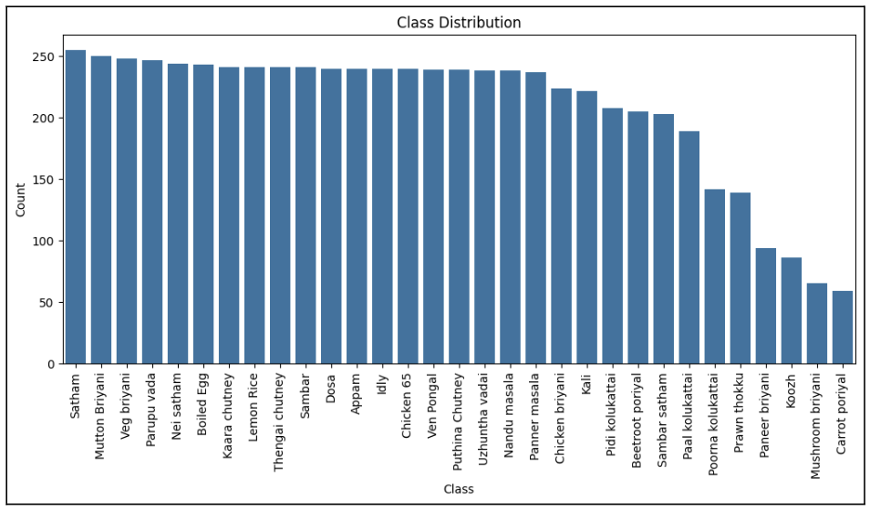 *Figure 4.3.1: Image count per class — South Indian food detection dataset, showing all classes* |
| :---: |

**Geographic Balance — Combined Dataset**

| Cuisine Region | IndianFood10 | IndianFoodNet-30 | South Indian Dataset | Combined % |
| ----- | ----- | ----- | ----- | ----- |
| North Indian | \~75% | \~65% | \~15% | \~45% |
| South Indian | \~25% | \~20% | \~80% | \~42% |
| East / West Indian | 0% | \~15% | \~5% | \~13% |

    	*Table 4.3* 

The South Indian dataset brings the combined corpus to approximately 42% South Indian representation — a significant improvement from the 23% without it.

| 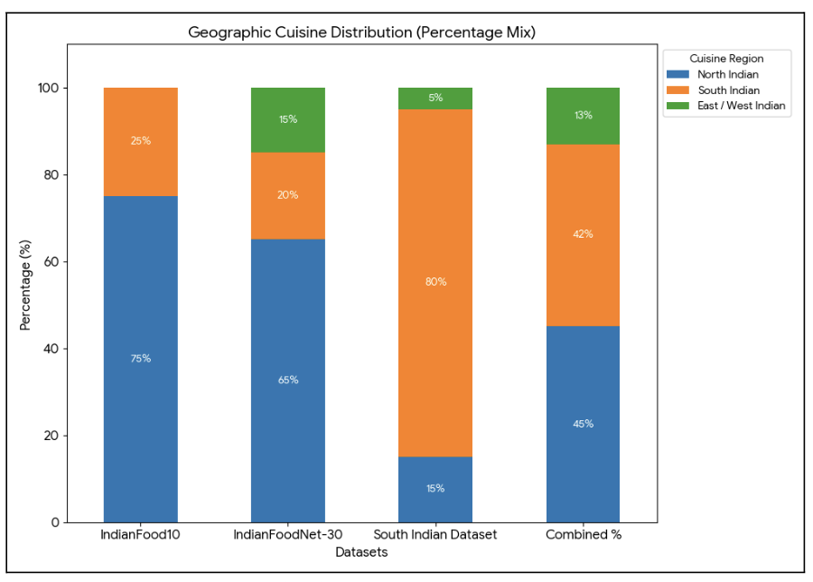*Figure 4.3.2: Geographic cuisine distribution across IndianFood10, IndianFoodNet-30, South Indian dataset, and combined total* |
| :---: |

**Image Quality Notes**

* Variable resolution: 416px to 1280px width. All images will be standardised to 640×640 for YOLOv8.

* Includes restaurant photography, home cooking, and food blog style, representative of real user photos.Some dim indoor lighting samples present brightness augmentation, which will address this.

| 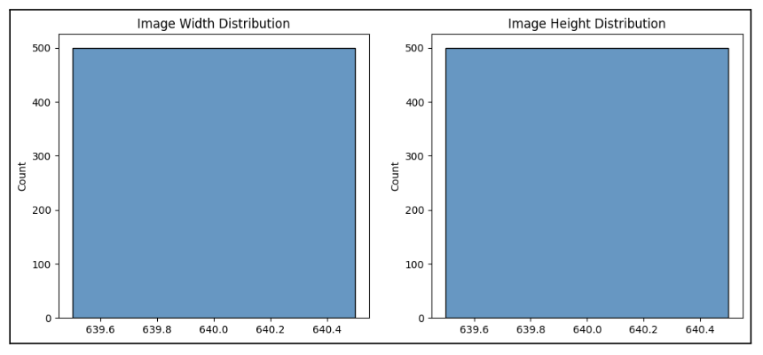 *Figure 4.3.3: Width and height distribution across the South Indian dataset* |
| :---: |

## **4.4  Nutrition Dataset EDA**

**Calorie Distribution**

The calorie distribution across 310+ Indian foods is right-skewed. Most foods fall between 50–250 kcal per 100g. Deep-fried items (samosa, puri, bhatura) reach 300–450 kcal. Liquid-based dishes (rasam, dal, kadhi) are at 40–130 kcal.

| 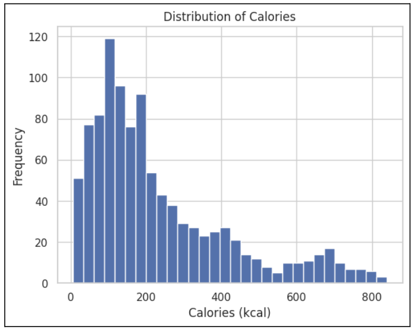 *Figure 4.4.1: Calorie distribution per 100g across all 310+ foods*  |
| :---: |

**Macronutrient Profile by Food Category**

| Food Category | Avg Calories | Avg Protein (g) | Avg Carbs (g) | Avg Fat (g) |
| ----- | ----- | ----- | ----- | ----- |
| Rice Dishes | 170 kcal | 3.8 | 36 | 1.2 |
| Lentil / Dal Dishes | 118 kcal | 7.4 | 18 | 2.8 |
| Breads (Roti / Naan) | 297 kcal | 9.1 | 52 | 5.6 |
| Vegetable Curries | 98 kcal | 3.2 | 12 | 4.1 |
| Dairy (Paneer / Curd) | 204 kcal | 12.6 | 8 | 14.2 |
| Non-Vegetarian Dishes | 165 kcal | 18.4 | 6 | 8.9 |
| Deep Fried Snacks | 372 kcal | 6.2 | 44 | 18.7 |

						*Table 4.4*

| 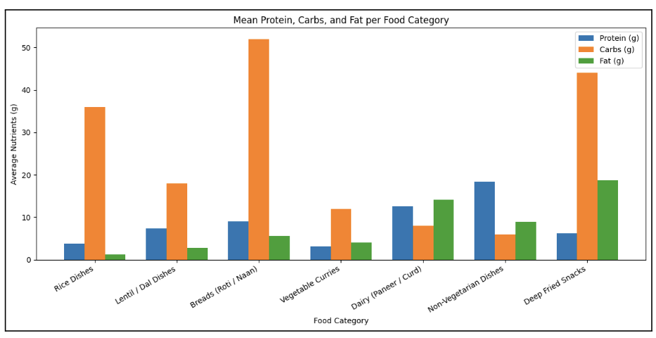 *Figure 4.4.2: Mean Protein, Carbs, Fat per food category — side-by-side bars per category* |
| :---: |

| 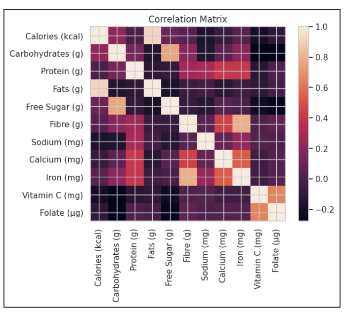 *Figure 4.4.3: Pearson correlation between Calories, Protein, Carbs, Fat, Fiber, Sodium across all 310+ foods* |
| :---: |

# **5\. Weight Estimation Pipeline**

Weight estimation is the most novel component of Nutri Vision. No public dataset exists for mapping Indian food pixel area to weight in grams. This section documents the full data collection and model training approach.

## **5.1  Why Depth Estimation Was Rejected**

| Approach | Suitable for Indian Food? | Reason |
| ----- | ----- | ----- |
| ZoeDepth / MiDaS (3D depth) | No | Dal, sambar, curry are liquid — depth map is unreliable and noisy |
| Volume reconstruction | No | Roti and dosa are flat — near-zero height gives incorrect volume estimate |
| Pixel ratio → MLP (chosen) | Yes | Pixel area reliably correlates with portion size for both flat and liquid foods |

						

## **5.2  How the MLP is Trained — Step by Step**

The MLP is trained entirely on data generated from the team's own plate photographs. The process is:

|   Step 1: Plate photographs collected by team (100images)            Overhead angle,kitchen scale ground truth   Step 2: Images passed through trained YOLOv8-seg model            → food\_name, pixel per food            → plate\_pixel from plate detection class   Step 3: pixel\_ratio \= pixel\_food ÷ pixel\_plate            This is the primary input feature for the MLP   Step 4: Each row saved to CSV:            \[food\_name,pixel\_ratio,pixel\_plate,pixel\_food, actual\_weight\_g\]   Step 5: MLP trained on this CSV            Input:  pixel\_ratio,pixel\_plate,pixel\_food \+                    food\_class\_encoded            Output: predicted weight in grams |
| :---- |

# **6\. Nutrition & Suggestion Pipeline**

## **6.1  Nutrition Lookup**

After Stage 2 estimates weight\_g per food, nutrition values are retrieved using a rag .

|   food\_name \= 'dal\_makhani',  weight\_g \= 147g              │              ▼   Search nutrition CSV → row found: per 100g values     calories=127, protein=5.4, carbs=16.2, fat=4.1              │              ▼   scale \= 147 / 100 \= 1.47              │              ▼   Actual intake: calories=186.7, protein=7.9g,                  carbs=23.8g, fat=6.0g              │              ▼   Repeat for all detected foods → sum for full meal total |
| :---- |

## **6.2  Daily Tracking Against ICMR RDA**

Cumulative daily intake is compared against ICMR Recommended Dietary Allowances specific to the user's age, gender, and activity level, entered during onboarding.

| User Profile | Calories (kcal) | Protein (g) | Carbs (g) | Fat (g) | Iron (mg) |
| ----- | ----- | ----- | ----- | ----- | ----- |
| Male 19–29, Sedentary | 2110 | 54 | 304 | 58 | 17 |
| Male 19–29, Moderate | 2710 | 54 | 390 | 75 | 17 |
| Female 19–29, Sedentary | 1660 | 46 | 239 | 46 | 29 |
| Female 19–29, Moderate | 2110 | 46 | 304 | 58 | 29 |
| Male 30–59, Moderate | 2710 | 52 | 390 | 75 | 17 |
| Female 30–59, Moderate | 2110 | 45 | 304 | 58 | 29 |

*ICMR RDA values from ICMR-NIN Dietary Guidelines for Indians 2024 — free PDF, official Indian government data. Stored as a static Python dictionary. No ML or API required for this step.*

## **6.3  RAG Pipeline — Pinecone \+ ICMR Documents**

| Document | Coverage | Why Included |
| ----- | ----- | ----- |
| ICMR Dietary Guidelines for Indians 2024 | RDA values, food groups, and Indian meal planning | Primary reference for all suggestions |

**Pinecone Setup**

* All documents are split into 512-token chunks and embedded using the Google text-embedding-004 model.

* Embeddings stored in Pinecone serverless index — free tier is sufficient.

* At inference: user's nutrient deficit \+ health profile sent as query → top 5 passages retrieved.

* Retrieved passages were injected into the Gemini API prompt as grounding context.

## **6.4  Gemini API \+ MedGemma — Suggestion Generation**

| Model | Role | What It Contributes |
| ----- | ----- | ----- |
| Gemini API | Primary reasoning \+ response generation | Reads user profile \+ RAG context \+ Indian food list → generates specific Indian food recommendations with portion guidance |
| MedGemma | Medical safety review layer | Checks Gemini output for conflicts with user's health conditions — flags if a suggestion is inappropriate for diabetics, high BP, thyroid patients, etc. |

# **7\. Preprocessing Strategy**

## **7.1  Detection Datasets**

| Preprocessing Step | Action | Reason | Applied To |
| ----- | ----- | ----- | ----- |
| Resize | 640×640 px | YOLOv8 standard input resolution | All image datasets |
| Normalise | Pixel values 0.0–1.0 | Stable training gradient flow | All image datasets |
| Treat missing values | Imputed missing values with the median | Data loss | Nutrition dataset |
