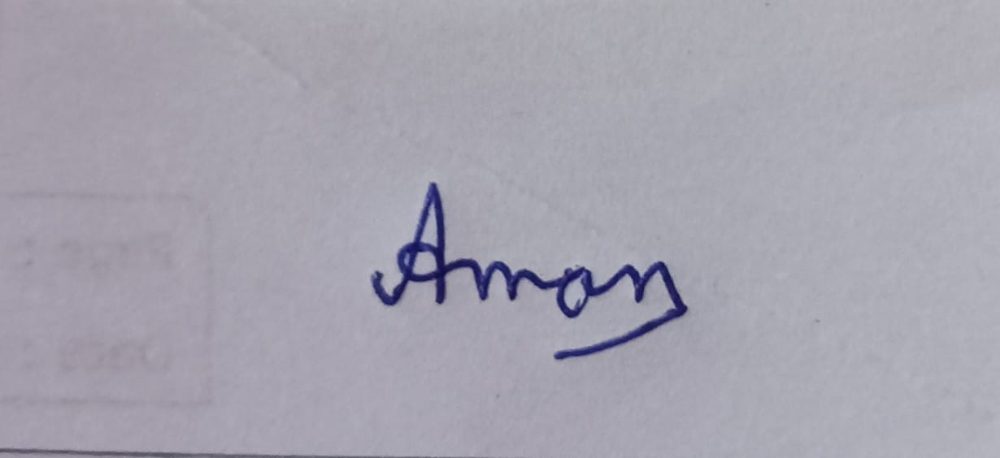
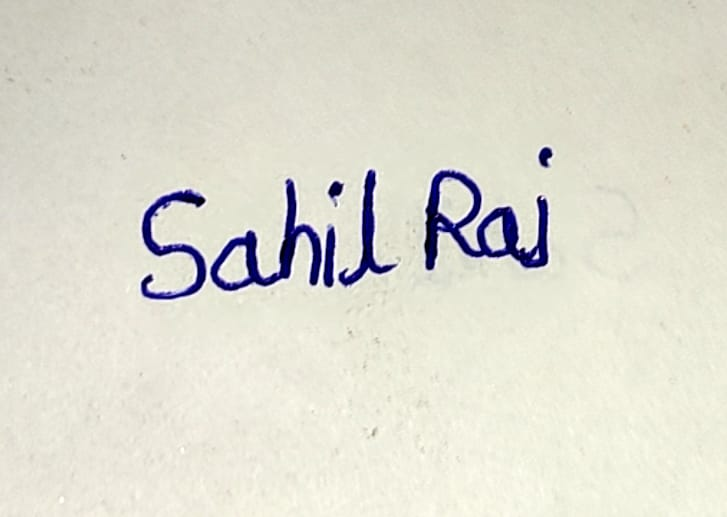
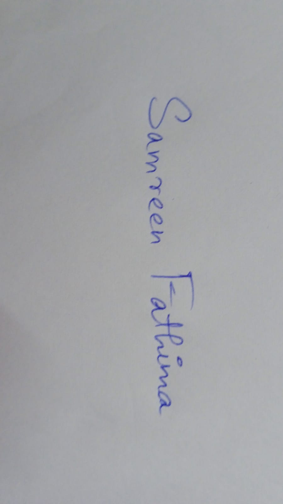
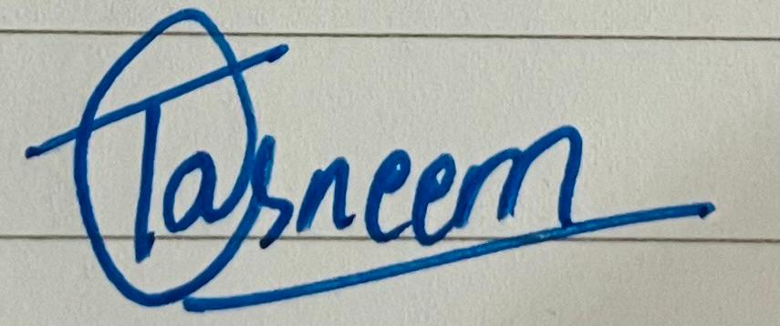

# Developer Guide

## **Introduction**

Welcome to the Developer guide for running NutriVision; an AI-powered food analysis system designed to perform nutritional analysis of food images uploaded by users and provide dietary recommendations.

The system integrates multiple components to enable:

- Food segmentation using a SAM-based model
- Food classification using ConvNeXtV2 and EfficientNetV2
- Object dimension estimation using PCA
- Volume and weight estimation via coin-based calibration
- Nutrition information retrieval
- LLM-based dietary recommendations

The project is modular and reproducible by following the steps below.

## Pipeline flow

Input Image
→ Segmentation (SAM)
→ Classification (ConvNeXtV2)
→ PCA Estimation
→ Coin Calibration
→ Volume Estimation
→ Weight Estimation
→ Nutrition Lookup
→ LLM Suggestions

## **System Architecture**
```
User Input (Image)
        │
        ▼
Gradio Interface (app.py)
        │
        ▼
Inference Pipeline (pipeline.py)
        │
        ▼
Model Loader (models.py)
        │
        ▼
Prediction (Food Class)
        │
        ▼
Nutrition Mapping (JSON files)
        │
        ▼
Final Output (Calories, Nutrition Info)
```
## **Exploratory Data Analysis (EDA)**

This section explains how to **reproduce the Exploratory Data Analysis (EDA)** for the dataset using a Colab notebook.

### Dataset Overview
- Total categories: 80 food classes
- Total images: 131,819
- This is a multi-class image classification problem with a large dataset. The dataset can be sourced from the following link: https://khana.omkarprabhu.in/

This section explains how to **manually reproduce the Exploratory Data Analysis (EDA)** for the dataset using a Colab notebook.

### Notebook Reference
[EDA Notebook](../../Notebooks/EDA/)

### Steps to Reproduce

1. Open the notebook in Jupyter/Google Colab  
2. (Colab only) Mount Google Drive  
3. Set dataset path correctly (`/content/dataset/khana`)  
4. Run all cells sequentially  
5. Verify outputs (counts, plots, sample images)

Key steps present in the notebook:
- Step 1: Mount Google Drive 
- Step 2: Set Dataset Path
- Step 3: Verify Dataset Structure
- Step 4: Count Images per Category
- Step 5: Visualize Class Distribution
- Step 6: Display Sample Images
- Step 7: Analyze Image Dimensions
- Step 8: Plot Dimension Distribution
- Step 9: Check Image Modes
- Step 10: Aspect Ratio Analysis
- Step 11: Corrupted Image Check

### Important Configurations

- Dataset format: folder-based (each folder = class)
- Total classes: ~80
- Total images: ~131k
- Image format: mostly RGB
- Image size: ~500×500 (uniform)
- No corrupted images detected

### Expected Outputs

- Class distribution plot (`dataset_distribution.png`)
- Sample images visualization
- Image size statistics (width, height)
- Aspect ratio analysis (≈ 1.0)
- Image mode distribution (RGB dominant)

### Key Observations

- Dataset is **highly imbalanced**
- Images are **uniform and square**
- Minimal preprocessing required

---

## **Model Training**

### Notebook Reference
[Model Training Notebook](../../Notebooks/Model%20Training/)
### Steps to Reproduce

1. Open the notebook in Google Colab  
2. Set runtime to **GPU (T4 / L4 / A100)**  
3. Mount Google Drive (for checkpoint saving)  
4. Run all cells sequentially:
   - Dataset download & extraction  
   - File scanning & label mapping  
   - Train/Val/Test split  
   - DataLoader setup  
   - Model training  
5. Monitor training logs per epoch  
6. After training, check outputs in `/content/outputs`

Key steps present in the notebook:
1. Mount Drive & Install
2. Imports
3. Configuration
4. Download Dataset
5. Load Checkpoint
6. File Scan
7. Splits & Sampler
8. Transforms & Dataset
9. Model
10. Optimizer / Scheduler / Loss
11. Metrics
12. Resume Training ← **main loop with Drive backup**
13. Training Curves
14. Test Evaluation
15. Per-Class Report
16. Confusion Matrix
17. Sample Predictions
18. Artifacts & Cleanup

### Important Configurations

- Model: **ConvNeXtV2 Tiny (pretrained)**
- Image size: **176 × 176** (optimized for speed)
- Batch size: **128 (T4 GPU)**
- Epochs: **5 (resume supported)**

- Class imbalance handled using:
  - `WeightedRandomSampler`

- Optimizer:
  - AdamW  
  - Backbone LR: `1e-4`  
  - Head LR: `1e-3`

- Loss:
  - CrossEntropy with Label Smoothing (0.1)

- Scheduler:
  - Warmup + Cosine decay

- Performance optimizations:
  - Mixed Precision (AMP)
  - `cudnn.benchmark = True`
  - `torch.compile()` (if available)

- Checkpointing:
  - Saved locally + auto backup to Google Drive

### Expected Outputs

Artifacts generated in `/content/outputs`:

- `best_convnextv2_tiny.pt` (trained model)
- `training_history.csv`
- `training_curves.png`
- `dataset_distribution.png`
- `confusion_matrix.png`
- `classification_report.txt`
- `sample_predictions.png`

### Expected Performance

- Best Validation F1: **~0.92**
- Test Top-1 Accuracy: **~94–95%**
- Test Top-5 Accuracy: **~99%+**
- Test Macro F1: **~0.92–0.93**

### Key Notes

- Training supports **resume from checkpoint**  
- Model automatically saves **best performing weights**  
- Class imbalance handled effectively via sampling  
- Pipeline is optimized for **Colab GPU environments**

---

##  **Model Evaluation**

###  Notebook Reference
[Model Evaluation Notebook](../../Notebooks/Model%20evaluation)

###  Steps to Reproduce

1. Open the notebook in **Google Colab**
2. Set runtime to **GPU (recommended)**
3. Run all cells sequentially:
   - Install dependencies
   - Download dataset & checkpoints
   - Prepare test dataset
   - Load trained models
   - Run inference
   - Compute metrics & generate plots
4. Check outputs saved in the working directory

###  Key Steps Covered in Notebook

The notebook performs the following:

1. Environment Setup
2. Dataset Preparation
3. Data Splitting
4. Data Loading
5. Model Loading
6. Inference 
7. Metric Computation
8. Model Comparison
10. Visualization
11. Error Analysis
12. Qualitative Analysis
13. Model Explainability (Optional)

### Important Configurations

- Models:
  - EfficientNetV2-S  
  - ConvNeXtV2-Tiny  
  - Ensemble (average)

- Image size: **224 × 224**
- Batch size: **32**
- Test split: **20% (stratified)**

### Expected Outputs

- `eval_results.csv`
- `metric_comparison.png`
- `cm_efficientnetv2.png`
- `cm_convnextv2.png`
- `roc_curves.png`
- `pr_curves.png`
- `per_class_f1.png`
- `confidence_distribution.png`
- `calibration.png`
- `model_agreement.png`
- `failures_eff.png`
- `gradcam_eff.png` (optional)

### Expected Performance

| Model                 | Top-1 | Top-5 | F1    | ROC-AUC | mAP   |
|----------------------|------|------|------|--------|------|
| EfficientNetV2-S     | ~0.36 | ~0.59 | ~0.33 | ~0.89 | ~0.38 |
| ConvNeXtV2-Tiny      | ~0.01 | ~0.05 | ~0.002 | ~0.50 | ~0.01 |
| Ensemble             | ~0.36 | ~0.58 | ~0.33 | ~0.86 | ~0.37 |

### Key Observations

- EfficientNetV2 significantly outperforms ConvNeXtV2  
- ConvNeXtV2 shows poor generalization (likely training mismatch)  
- Ensemble does not significantly improve results  
- Strong class confusion observed in visually similar categories  
- Fine-grained classification remains challenging  

---

##  Food Weight Estimation Pipeline

###  Notebook Reference
[Weight Estimation Notebook](../../Notebooks/Weight_PCA/)

###  Steps to Reproduce

1. Open the notebook in **Google Colab**
2. Set runtime to **GPU**
3. Mount Google Drive (for model weights)
4. Upload / set input image:
   - Ensure a **₹10 coin (2.7 cm diameter)** is visible in the image
5. Run all cells sequentially:
   - Install dependencies (SAM3, Albumentations, etc.)
   - Load SAM3 segmentation model
   - Detect food + coin regions
   - Compute pixel-to-cm scale using coin
   - Classify food using ConvNeXtV2
   - Apply PCA on segmented masks
   - Estimate geometric dimensions
6. Check outputs in `/content/pipeline_out`

### Key Steps Covered in Notebook

The pipeline performs:

1. **Environment Setup**
   - Install SAM3 and required dependencies
   - Configure GPU optimizations

2. **Segmentation (SAM3)**
   - Segment:
     - Food items  
     - Containers (bowls/plates)  
     - Coin (for scale reference)
   - Use multiple prompts for robust detection

3. **Detection Merging**
   - Combine multiple SAM outputs  
   - Remove overlapping/duplicate masks  
   - Filter food inside containers  

4. **Scale Estimation (Coin-Based)**
   - Detect ₹10 coin  
   - Apply PCA on coin mask  
   - Compute:
     - Pixels per cm  
   - Formula:
     ```
     pixels_per_cm = coin_diameter_pixels / 2.7
     ```

5. **Food Classification**
   - Use **ConvNeXtV2 Tiny**
   - Classify each segmented food region  
   - Filter low-confidence predictions  

6. **PCA Geometry Extraction**
   - Apply PCA on food mask pixels  
   - Compute:
     - Major axis → diameter  
     - Minor axis → width  
     - Orientation angle  

7. **Height Estimation**
   - Approximate using bounding box  
   - Apply empirical scaling factor  

8. **3D Shape Approximation**
   - Model food as **paraboloid-like shape**  
   - Estimate:
     - Radius  
     - Height  
     - Volume proxy  

9. **Visualization**
   - Segmentation overlays  
   - PCA ellipse + axes  
   - Coin scaling visualization  
   - Shape approximation plots  

### Important Configurations

- Coin diameter: **2.7 cm (₹10 coin)**
- SAM3 confidence threshold: `0.6`
- IoU threshold (merge): `0.4`
- Containment threshold: `0.25`

- ConvNeXtV2:
  - Confidence threshold: `0.8`

- YOLO (if used):
  - Confidence threshold: `0.35`

- Fallback scale:
  - `18 px/cm` (if coin not detected)

### Expected Outputs

Generated in `/content/pipeline_out`:

- `overview.png` (segmentation result)
- `coin_scale.png` (scale estimation)
- `pca_*.png` (per-food PCA visualization)

For each detected food item:
- Predicted class  
- Diameter (cm)  
- Width (cm)  
- Height (cm)  
- PCA orientation  

### Expected Behavior

- Accurate segmentation of food items  
- Reliable scale estimation using coin  
- Correct classification for common food items  
- Reasonable geometric approximation of food shape  

### Important Notes

- Coin must be:
  - Fully visible  
  - Flat (not tilted)  
- Poor lighting or occlusion may affect segmentation  
- PCA assumes roughly elliptical shapes  
- Height estimation is approximate (not exact)   

---
With segmentation, classification, and geometric estimation in place, the complete pipeline is ready to be integrated into an application.
We can proceed to deployment to run the full system end-to-end with user input.

## **Deployment**

### 1. Prerequisites
Ensure the following before setup:

Python 3.9 or higher
Lightning AI environment (for deployment)
Access to model weights (via Google Drive link)
API credentials:
Hugging Face Token
Ollama API Key
### 2. Clone the repo on root folder
```
git clone --filter=blob:none --sparse https://github.com/23f3001764/Group-2-DS-and-AI-Lab-Project.git
cd Group-2-DS-and-AI-Lab-Project
git sparse-checkout set nutrivision_codes
cd nutrivision_codes
```
### 3. Environment Configuration
Set the following environment variables in your platform in global api (Lightning AI):
https://lightning.ai/<profile_id>/home?settings=secrets 
```
HF_TOKEN=<your_huggingface_token>
OLLAMA_API_KEY=<your_ollama_api_key>
```
### 4. Installation
Install all required dependencies:
```
pip install -r requirements.txt
```
### 5. Activate the GPU T4
GPU cost : 0.14$ per hour
### 6. Model Setup
1. Navigate to:
```files_models/model_py.txt```
3. Download the model weights from the provided Google Drive link.
```
cd files_models
gdown https://drive.google.com/file/d/1w8PQt-7Ofn4pjTUUC2YqwIxEicy2Zxhe/view?usp=sharing
cd ..
```
4. Place the downloaded weights inside:
```files_models/```
The application will not run without the model weights.
you can correct all the paths on config.py if you face any error

### 7. Running the Application
Execute the application using:
```
python app.py
```
the you can acess the web app on network url showing in the terminal
### 8. Deployment (Lightning AI)
First download & Install the gradio by clicking + sign in the right hand tool bar and then opening web apps and after installing it open the gradio
and give the port 7860 and in running command python app.py and choose the T4 GPU

Configure the deployment with:

Framework: Gradio
Mode: Serverless
Port: 7860

Once deployed, the application will be accessible via a public endpoint.

## Dependencies used

The complete list of dependencies used for the final run is:

```python
# ── Deep Learning ─────────────────────────────────────────────────────────
torch==2.11.0
torchvision==0.26.0
timm==1.0.26
transformers==5.5.1

# ── Computer Vision / Image Processing ────────────────────────────────────
albumentations==2.0.8
opencv-python-headless==4.13.0.92
pillow==10.4.0

# ── ML / Math ─────────────────────────────────────────────────────────────
numpy==2.4.4
scikit-learn==1.8.0

# ── LLM / LangChain ───────────────────────────────────────────────────────
langchain-core==1.2.28
langchain-openai==1.1.12
openai==2.31.0

# ── Data / Plotting ───────────────────────────────────────────────────────
pandas==3.0.2
matplotlib==3.10.8

# ── Gradio UI ─────────────────────────────────────────────────────────────
gradio==6.11.0

# ── Pydantic (used in pipeline for output parsing) ────────────────────────
pydantic==2.12.5

# ── HuggingFace Hub (model download, SAM3) ────────────────────────────────
huggingface_hub==1.9.2
gdown
```

## Repository Structure

```python
main/
│── Archive/Deprecated_Experiments/...
│
├── Notebooks/
│   ├── EDA/
│   │   ├── Khana_Dataset_EDA.ipynb
│   │
│   ├── Model_Training/
│   │   ├── ConvNeXtV2_Training.ipynb
│   │
│   ├── Model_Evaluation/
│   │   └── Model_Pipeline_Evaluation.ipynb
│   │
│   └── Weight_PCA/
│       └── Weight_PCA_Pipeline.ipynb
│
├── Presentation/
│   ├── Milestone_1.pdf
│   ├── Milestone_2.pdf
│   ├── Milestone_3.pdf
│   ├── Milestone_4.pdf
│   └── Milestone_5.pdf
│
├── Report/
│   ├── Contribution/
│   │   ├── Milestone1_Contribution.md
│   │   ├── Milestone2_Contribution.md
│   │   ├── Milestone3_Contribution.md
│   │   └── Milestone4_Contribution.md
│   │
│   ├── Images/
│   │
│   ├── Milestone_1_Report.md
│   ├── Milestone_2_Report.md
│   ├── Milestone_3_Report.md
│   ├── Milestone_4_Report.pdf
│   └── Milestone_5_Report.pdf
│
├── data/
│   └── data.md
│
├── nutrivision_codes/
│   └── files_models/
│   │   ├── food_density.json        # Density values for portion estimation
│   │   ├── food_nutrition.json      # Nutritional database
│   │   └── model_py.txt             # Contains link to model weights
│   │
│   ├── test_images/..               # Sample inputs for testing
│   │
│   ├── app.py                       # Entry point (Gradio UI)
│   ├── config.py                    # Configuration and constants
│   ├── models.py                    # Model loading logic
│   ├── pipeline.py                  # Core inference pipeline
│   ├── requirements.txt             # Dependencies
│   └── README.md
│
├── .gitignore
│
└── NutriVision – AI Food Analyzer.pdf
```

This repository includes additional notebooks for experimentation and model development:

- EDA — dataset exploration
- Model Training — ConvNeXtV2, EfficientNetV2, YOLO
- Hyperparameter tuning
- PCA and geometry experiments

These are not required to run the final pipeline and are provided for reference.

## Module Description
- app.py
Main application entry point
Builds and launches the Gradio interface
Handles user input and displays output
- pipeline.py
Core logic for inference
Handles:
Image preprocessing
Model prediction
Post-processing
- models.py
Loads trained model and weights
Ensures the model is ready for inference
- config.py
Stores:
File paths
Constants
Environment configurations
- JSON Files
food_nutrition.json
→ Maps food items to nutritional values
food_density.json
→ Supports portion/density-based calculations

- **Repository Link:**  
  https://github.com/23f3001764/Group-2-DS-and-AI-Lab-Project.git  

- **Reviewed By:**

  - **Aman Mani Tiwari**  
    

  - **Sahil Raj**  
    

  - **Sahil Sharma**  
    

  - **Samreen Fathima**  
    

  - **Tasneem Shahnawaz**  
    

